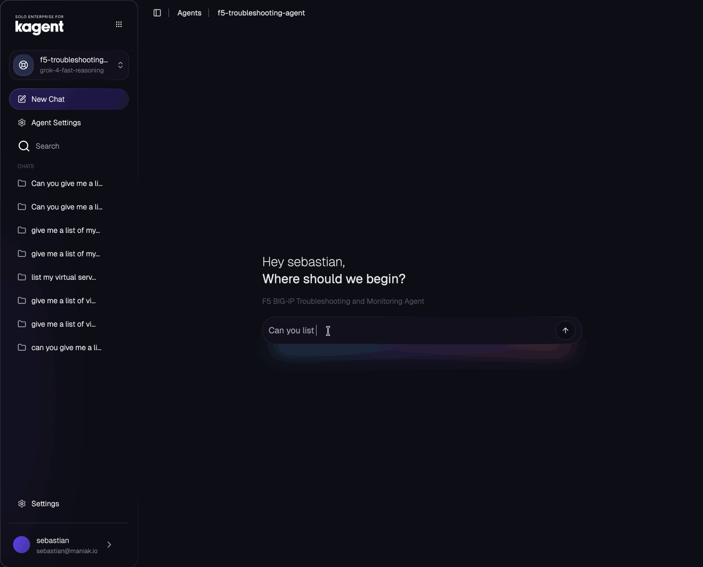

# Bringing AI-Powered Load Balancer Management to Kubernetes with kagent and F5 BIG-IP

*How we built an MCP server to give AI agents direct access to F5 BIG-IP infrastructure*

---

## The Problem: Managing Legacy Infrastructure in Modern Environments

If you've worked with F5 BIG-IP load balancers, you know they're powerful, enterprise-grade devices that have been the backbone of application delivery for decades. But here's the challenge: managing F5 devices often feels disconnected from modern Kubernetes workflows. DevOps teams constantly context-switch between `kubectl` commands for their containerized apps and the F5 web UI or iControl REST API for load balancer configurations.

What if your AI assistant could bridge that gap? What if you could simply ask:

> "Hey, why is traffic not reaching my backend pods?"

And your AI assistant could automatically check both your Kubernetes services *and* your F5 virtual servers, pools, and pool members to give you a complete picture?

That's exactly what we built with the **F5 BIG-IP MCP Server for kagent**.

---

## What is MCP and kagent?

Before diving in, let's quickly cover two key technologies:

**Model Context Protocol (MCP)** is an open protocol that lets AI assistants connect to external tools and data sources. Think of it as a standardized way for AI models to "call functions" in the real world.

**kagent** is a Kubernetes-native AI agent platform that brings MCP servers directly into your cluster. It uses Kubernetes Custom Resource Definitions (CRDs) to discover and orchestrate MCP tools, making them available to AI assistants running in your infrastructure.

Together, they create a powerful pattern: AI agents that can observe and interact with your infrastructure through well-defined, secure interfaces.

---

## Architecture: How It All Fits Together



Here's how the components work together:

1. **AI Assistant (kagent)** - Your conversational interface running in Kubernetes
2. **RemoteMCPServer CRD** - Kubernetes resource that registers the F5 MCP server
3. **F5 MCP Server** - A Python FastMCP service that exposes F5 operations as MCP tools
4. **F5 BIG-IP Device** - Your existing load balancer (no modifications needed!)

The beauty of this architecture is that it's *completely non-invasive*. Your F5 device doesn't need any changes - we simply wrap its existing iControl REST API with MCP tools that AI agents can understand and use.

---

## What Can It Do?

The F5 MCP server exposes three core tools:

### 1. **obj_list** - List F5 Objects
```
"Show me all virtual servers"
"List the pools on F5"
```

### 2. **get_pool_status** - Check Pool Health
```
"What's the status of the web-app-pool?"
"Are all pool members healthy?"
```

### 3. **get_virtual_server_status** - Virtual Server Details
```
"Show me details for vs-production"
"Which pool is serving traffic for the API virtual server?"
```

These simple primitives unlock powerful troubleshooting workflows when combined with an AI agent's ability to reason and chain operations together.

---

## Real-World Use Cases

### Scenario 1: Debugging Traffic Issues

**You:** "Users are reporting 502 errors on the API"

**Agent:** *Checks Kubernetes pods → All healthy → Checks F5 virtual server → Pool shows 'offline'*

**Agent:** "The API pods are running fine, but the F5 pool 'api-backend-pool' is marked offline. Two of three members are down. Let me show you the details..."

### Scenario 2: Pre-Deployment Validation

**You:** "I'm about to deploy v2 of the app. Check if F5 is ready"

**Agent:** *Verifies virtual servers exist, checks pool members, validates configuration*

**Agent:** "The F5 configuration looks good. Virtual server 'vs-app-v2' is configured with pool 'app-v2-pool' containing 5 healthy members. You're clear to proceed."

### Scenario 3: Capacity Planning

**You:** "Do we have capacity to add more pods to the backend?"

**Agent:** *Checks current pool members, analyzes load distribution, reviews connection limits*

**Agent:** "Currently you have 8 pool members with a max of 20 configured. You can safely add 12 more pods. The current pool is at 40% capacity."

---

## Deploying to Your Kubernetes Cluster

Getting started is straightforward. Here's the 5-minute deployment:

### Prerequisites

- Kubernetes cluster with `kubectl` access
- kagent installed in the `kagent` namespace
- F5 BIG-IP device with API access
- F5 credentials (username/password)

### Step 1: Configure Credentials

Create base64-encoded credentials:

```bash
echo -n "172.16.10.10" | base64    # Your F5 IP
echo -n "admin" | base64            # Your username
echo -n "your-password" | base64    # Your password
```

Update `k8s/secret.yaml` with your encoded values.

### Step 2: Deploy Everything

```bash
cd k8s
./deploy.sh
```

That's it! The script will:
- Deploy the F5 MCP server
- Create the ClusterIP service
- Register with kagent
- Wait for everything to be ready

### Step 3: Test It

Ask your kagent agent:

```
"List all virtual servers on F5"
```

If you see a response with your virtual servers, you're up and running!

---

## Under the Hood: Technical Deep Dive

For those curious about the implementation, here's what makes it tick:

### The MCP Server

Built with Python's [FastMCP](https://github.com/jlowin/fastmcp) framework and F5's [bigrest](https://github.com/leonardobdes/BIGREST) library:

```python
from fastmcp import FastMCP
from bigrest.bigip import BIGIP

mcp = FastMCP("F5 BIG-IP MCP Server")

@mcp.tool
def get_pool_status(pool_name: str = None):
    """Get status information for F5 pools"""
    br = BIGIP(device=F5_HOST, username=F5_USER,
               password=F5_PASS, session_verify=False)

    if pool_name:
        pool = br.load(f'/mgmt/tm/ltm/pool/{pool_name}')
        return pool.properties
    # ... return all pools
```

The server runs as an HTTP endpoint on port 8081, exposing the MCP protocol over stateless HTTP for maximum compatibility with kagent.

### Kubernetes Resources

**Deployment**: Runs the MCP server container with F5 credentials injected from secrets
**Service**: Exposes port 8081 as a ClusterIP service
**RemoteMCPServer**: kagent CRD that makes the tools discoverable

```yaml
apiVersion: kagent.dev/v1alpha2
kind: RemoteMCPServer
metadata:
  name: f5-mcp-remote
spec:
  url: http://f5-mcp-server.kagent.svc.cluster.local:8081/mcp
  protocol: STREAMABLE_HTTP
  timeout: 30s
```

### Security Considerations

The current implementation:
- Uses Kubernetes secrets for credential storage
- Disables SSL verification (common with F5 self-signed certs)
- Runs with minimal resource limits (128Mi-512Mi RAM)
- Leverages Kubernetes RBAC for access control

For production, consider:
- External secret managers (Vault, AWS Secrets Manager)
- Proper SSL certificates on F5
- Network policies to restrict egress
- Audit logging for API calls

---

## Why This Matters

This project represents a broader trend: **Infrastructure as Conversation**.

Instead of remembering CLI syntax, navigating web UIs, or writing scripts for every operation, you can now have a natural conversation with your infrastructure. The AI agent handles the complexity of:

- Discovering what tools are available
- Chaining multiple operations together
- Correlating data across systems (K8s + F5)
- Presenting results in human-readable format

And because it's built on open standards (MCP, Kubernetes CRDs), it composes beautifully with other tools in your environment.

---

## What's Next?

This is just the beginning. Here are some ideas we're exploring:

**Write Operations**: Currently read-only, but we could add tools to:
- Enable/disable pool members
- Update virtual server configurations
- Drain pools before maintenance

**Advanced Monitoring**:
- Real-time health checks
- Performance metrics and graphing
- Alerting integration

**Multi-Device Support**:
- Manage fleets of F5 devices
- Cross-device policy synchronization
- Disaster recovery workflows

**Integration with GitOps**:
- Generate F5 configs from Kubernetes resources
- Automated validation pipelines
- Drift detection between declared and actual state

---

## Try It Yourself

The entire project is open source and ready to deploy:

**GitHub**: [f5-troubleshooting-ai-agent](https://github.com/aiagentplayground/f5-troubleshooting-ai-agent)

**Quick Start**:
```bash
git clone https://github.com/aiagentplayground/f5-troubleshooting-ai-agent
cd f5-troubleshooting-ai-agent/k8s
# Update secret.yaml with your F5 credentials
./deploy.sh
```

**Container Image**: `sebbycorp/f5-mcp-server:latest`

Full documentation, troubleshooting guides, and deployment scripts are included in the `k8s/` directory.

---

## Key Takeaways

1. **MCP enables AI-infrastructure integration** - A standardized protocol for connecting AI to enterprise tools
2. **kagent brings it to Kubernetes** - Native CRDs for managing MCP servers at scale
3. **Legacy systems can participate** - No need to modernize your entire stack; wrap existing APIs
4. **Start simple, grow complex** - Begin with read-only queries, expand to orchestration
5. **It's all about the developer experience** - Natural language beats memorizing syntax

---

## Join the Conversation

Have you built MCP servers for other infrastructure tools? What workflows would you want to automate with AI agents? We'd love to hear from you!

- Drop a comment below
- [Open an issue on GitHub](https://github.com/aiagentplayground/f5-troubleshooting-ai-agent/issues)
- Share your own MCP server implementations

Let's build the future of infrastructure management together - one conversation at a time.

---

## About the Stack

- **FastMCP** - Python framework for building MCP servers
- **bigrest** - Python library for F5 iControl REST API
- **kagent** - Kubernetes-native AI agent platform
- **F5 BIG-IP** - Enterprise application delivery controller

---

## Resources

- [Model Context Protocol Specification](https://modelcontextprotocol.io)
- [kagent Documentation](https://kagent.dev)
- [F5 iControl REST API Docs](https://clouddocs.f5.com/api/icontrol-rest/)
- [FastMCP on GitHub](https://github.com/jlowin/fastmcp)

---

*Want to learn more? Check out the full [deployment guide](k8s/README.md) or [open an issue](https://github.com/aiagentplayground/f5-troubleshooting-ai-agent/issues) with questions.*
