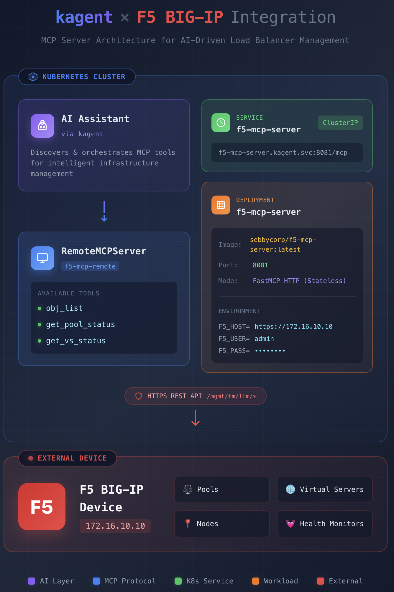

# F5 MCP Server Kubernetes Deployment

Deploy the F5 BIG-IP MCP Server to your Kubernetes cluster with kagent integration.

## Architecture



The architecture consists of:

- **AI Assistant**: kagent-powered assistant that discovers and orchestrates MCP tools
- **RemoteMCPServer**: Kubernetes CRD that registers the F5 MCP server with kagent
- **Service**: ClusterIP service exposing the MCP server on port 8081
- **Deployment**: Container running the F5 MCP server with tools for F5 management
- **Secret**: Stores F5 credentials (host, user, password)
- **F5 BIG-IP Device**: External load balancer (172.16.10.10) with pools, nodes, virtual servers

## Components

| Component | Type | Description |
|-----------|------|-------------|
| `f5-mcp-server` | Deployment | Main MCP server container |
| `f5-mcp-server` | Service | ClusterIP service exposing port 8081 |
| `f5-credentials` | Secret | F5 BIG-IP credentials and host |
| `f5-mcp-remote` | RemoteMCPServer | kagent CRD for MCP server registration |

## Prerequisites

1. **Kubernetes cluster** with `kubectl` access
2. **kagent** installed in the `kagent` namespace
   ```bash
   kubectl get namespace kagent
   ```
3. **F5 BIG-IP** device accessible from the cluster
4. **F5 credentials** with API access (admin or similar role)

## Quick Start

### Step 1: Configure F5 Credentials

Edit `secret.yaml` and update the base64-encoded values:

```bash
# Encode your F5 host (IP address only, no https://)
echo -n "172.16.10.10" | base64

# Encode your F5 username
echo -n "admin" | base64

# Encode your F5 password
echo -n "your-password-here" | base64
```

Update `secret.yaml` with your encoded values:
```yaml
data:
  F5_HOST: <base64-encoded-ip>
  F5_USER: <base64-encoded-username>
  F5_PASS: <base64-encoded-password>
```

### Step 2: Deploy to Kubernetes

Apply all manifests in order:

```bash
# Create the secret
kubectl apply -f secret.yaml

# Deploy the MCP server
kubectl apply -f deployment.yaml

# Create the service
kubectl apply -f service.yaml

# Register with kagent
kubectl apply -f remotemcpserver.yaml
```

Or apply all at once:

```bash
kubectl apply -f .
```

### Step 3: Verify Deployment

Check that all resources are running:

```bash
# Check deployment status
kubectl get deployment f5-mcp-server -n kagent

# Check pod status
kubectl get pods -n kagent -l app=f5-mcp-server

# Check service
kubectl get service f5-mcp-server -n kagent

# Check RemoteMCPServer registration
kubectl get remotemcpserver f5-mcp-remote -n kagent

# View pod logs
kubectl logs -n kagent -l app=f5-mcp-server --tail=50
```

Expected output:
```
NAME             READY   STATUS    RESTARTS   AGE
f5-mcp-server    1/1     Running   0          30s
```

### Step 4: Test with kagent

Ask your kagent agent to interact with F5:

```
"List all virtual servers on F5"
"What pools are configured on the F5?"
"Show me the status of pool my-app-pool"
```

## Configuration Details

### Environment Variables

The deployment uses these environment variables from the secret:

| Variable | Description | Example |
|----------|-------------|---------|
| `F5_HOST` | F5 BIG-IP IP address (no protocol) | `172.16.10.10` |
| `F5_USER` | F5 username | `admin` |
| `F5_PASS` | F5 password | `your-password` |
| `F5_VERIFY_SSL` | SSL verification (always false) | `false` |

### Resource Limits

Default resource configuration:

```yaml
resources:
  requests:
    memory: "128Mi"
    cpu: "100m"
  limits:
    memory: "512Mi"
    cpu: "500m"
```

Adjust these in `deployment.yaml` based on your needs.

### Network Requirements

The F5 MCP Server requires:
- Outbound HTTPS (443) access to F5 BIG-IP device
- Inbound HTTP (8081) access from kagent
- DNS resolution within the cluster

## Available MCP Tools

Once deployed, the following tools are available to kagent:

| Tool | Description | Parameters |
|------|-------------|------------|
| `obj_list` | List F5 LTM objects | `obj_type` (pool, node, virtual), optional `obj_name` |
| `get_pool_status` | Get pool status and members | optional `pool_name` |
| `get_virtual_server_status` | Get virtual server status | optional `vs_name` |

## Troubleshooting

### Pod not starting

```bash
# Check pod events
kubectl describe pod -n kagent -l app=f5-mcp-server

# Check logs
kubectl logs -n kagent -l app=f5-mcp-server
```

### Connection errors to F5

Common issues:

1. **"Failed to resolve 'https'"** - F5_HOST should be IP only, not `https://...`
   ```bash
   # Check secret value
   kubectl get secret f5-credentials -n kagent -o jsonpath='{.data.F5_HOST}' | base64 -d
   ```

2. **Network timeout** - Check F5 is reachable from pod:
   ```bash
   kubectl exec -n kagent deployment/f5-mcp-server -- curl -k https://172.16.10.10
   ```

3. **Authentication failed** - Verify credentials:
   ```bash
   # Test credentials manually
   kubectl exec -n kagent deployment/f5-mcp-server -- \
     curl -k -u admin:password https://172.16.10.10/mgmt/tm/ltm/pool
   ```

### kagent not seeing MCP server

```bash
# Check RemoteMCPServer status
kubectl describe remotemcpserver f5-mcp-remote -n kagent

# Check service endpoints
kubectl get endpoints f5-mcp-server -n kagent

# Test service connectivity
kubectl run -n kagent test-pod --rm -it --image=curlimages/curl -- \
  curl http://f5-mcp-server:8081/mcp
```

## Updating the Deployment

### Update F5 Credentials

```bash
# Update secret
kubectl apply -f secret.yaml

# Restart deployment to pick up new secret
kubectl rollout restart deployment/f5-mcp-server -n kagent
```

### Update Docker Image

```bash
# Update image in deployment.yaml, then
kubectl apply -f deployment.yaml

# Or force pull latest
kubectl rollout restart deployment/f5-mcp-server -n kagent
```

### Update RemoteMCPServer Configuration

```bash
kubectl apply -f remotemcpserver.yaml

# kagent will automatically reload the configuration
```

## Uninstalling

Remove all resources:

```bash
kubectl delete -f remotemcpserver.yaml
kubectl delete -f service.yaml
kubectl delete -f deployment.yaml
kubectl delete -f secret.yaml
```

Or delete by label:

```bash
kubectl delete all,secret,remotemcpserver -n kagent -l app=f5-mcp-server
```

## Security Considerations

1. **Secret Management**: Consider using external secret managers (Vault, AWS Secrets Manager, etc.)
2. **RBAC**: The pod service account only needs minimal permissions
3. **Network Policies**: Consider restricting pod egress to F5 IP only
4. **SSL Verification**: Currently disabled for self-signed certs. Enable if using proper CA.

## Additional Resources

- [kagent Documentation](https://kagent.dev)
- [F5 BIG-IP iControl REST API](https://clouddocs.f5.com/api/icontrol-rest/)
- [FastMCP Documentation](https://github.com/jlowin/fastmcp)

## Support

For issues or questions:
- Check logs: `kubectl logs -n kagent -l app=f5-mcp-server`
- Verify connectivity: Test F5 API access from pod
- Check kagent logs: `kubectl logs -n kagent -l app=kagent`
